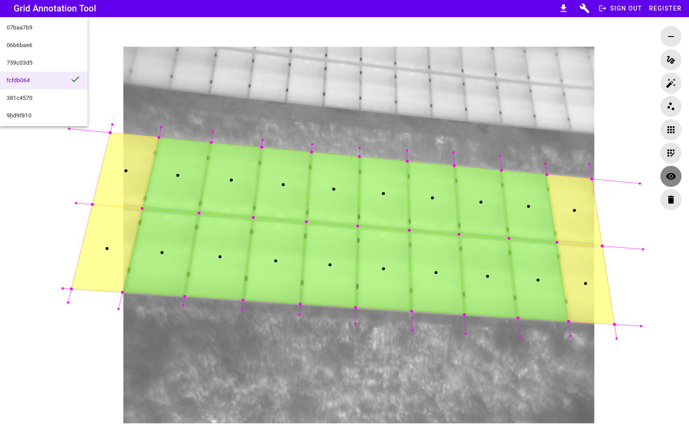
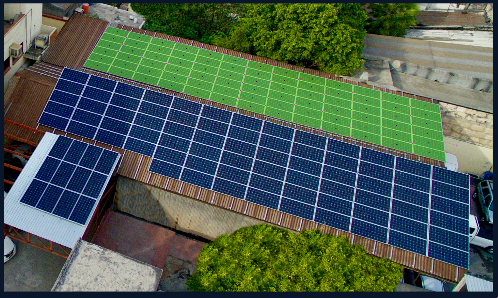
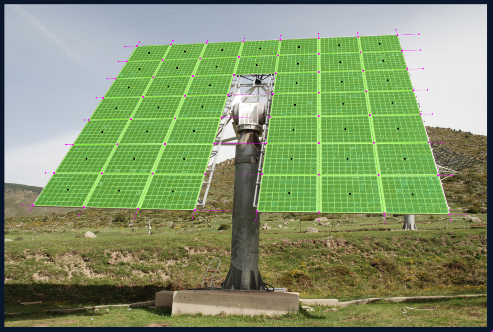
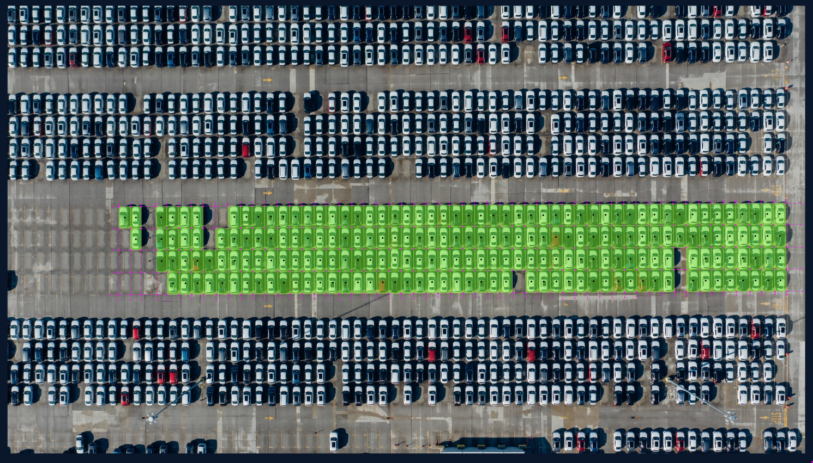
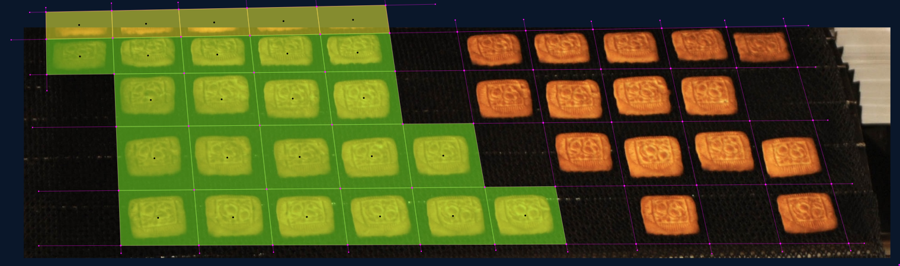
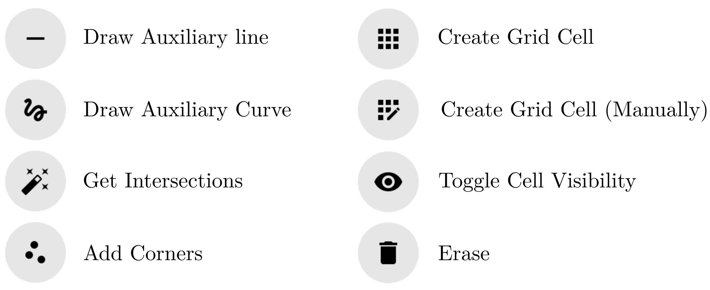

# Grid Annotation Tool 2

[](https://github.com/LukasBommes/Grid-Anotation-Tool-2/actions/workflows/main.yml)
[](https://github.com/LukasBommes/Grid-Anotation-Tool-2/tree/master/backend/tests)
[](https://github.com/LukasBommes/Grid-Anotation-Tool-2/issues)
[](https://github.com/LukasBommes/Grid-Anotation-Tool-2/blob/master/LICENSE)
[](https://github.com/psf/black)
[](https://github.com/prettier/prettier)

This is an updated version of the old [Grid Annotation Tool](https://github.com/LukasBommes/Grid-Annotation-Tool).

A web app for annotating grid structures in images for computer vision research and applications. For some applications you may want to annotate a grid structure to train, for example, an instance segmentation model, such as Mask R-CNN.

Different from existing annotation tools you do not have to draw a bounding box for each cell in your grid. Instead, you annotate the intersection lines, which is faster and yields cleaner co-linear edges. To account for lens distortion you can annotate both lines and curves.

This is a web app intended for self-hosting on a server or cloud instance. Please read the [Security Note](#security-note) below.



We initially developed this tool for annotating instance segmentation masks of photovoltaics modules, but it may be useful for other applications.

### Examples










### Security Note

This web app has been developed for private use and is by no means secure enough to be exposed to the Internet. We deployed the Grid Annotation Tool within our corporate network, allowing access only from within this network, i.e., via VPN. This allows collaboration without exposing the app to the Internet.


### Quickstart

To deploy the app, you need a linux server with [Docker Engine](https://docs.docker.com/engine/install/ubuntu/) and [Docker Compose](https://docs.docker.com/compose/install/) installed. We tested the app on a server with Ubuntu 20.04 LTS, Docker Engine 19.03.12, and Docker Compose 1.29.2.

You can also run the Grid Annotation Tool locally on your machine. Simply follow the installation instructions below. They do not differ much from the server installation.

#### Get the Source Code

In your shell navigate to the preferred installation directory and clone the repository
```
git clone https://github.com/LukasBommes/Grid-Anotation-Tool-2
```

#### Create Secrets

The app requires several secrets, for example for the PostgreSQL database and API authentication. A convenience script for generating these secret is provided in the project root directory. You have to run this script once with the following command.
```
chmod +x make_secrets.sh
./make_secrets.sh
```
This will generate the secrets under `docker/secrets`.

#### Build Docker Images

From the project root build the docker images with
```
sudo docker-compose build
```

#### Deploy the Grid Annotation Tool

The deployment configuration for Docker Compose is provided in `docker-compose.yml`. The default configuration runs the backend and frontend components of the Grid Annotation Tool, a PostgreSQL database, and a Traefik reverse proxy that acts as a load balancer. By default, HTTP is used. If you require HTTPS, you can alter the Traefik configuration as stated in the official Treafik documentation.

Before you can deploy the app, make sure you created the secrets as described above.

Now, deploy the Grid Annotation Tool with 
```
sudo docker-compose up
```
This starts all the containers as specified in the `docker-compose.yml`. 

Note, that by default the Grid Annotation Tool is deployed only locally, i.e., reachable only from localhost. For a server deployment you have to provide your server's IP address in `docker-compose.yml`. To this end, replace all occurences of the IP `127.0.0.1` with your server's public domain name or IP, e.g., `gridannotationtool.com`. In addition, add your IP into the list of allowed CORS origins of the backend service in `docker-compose.yml` as shown below. Note, that port 80 must be open on your server for the Grid Annotation Tool to be reachable.
```
backend:
    ...
    environment:
      - BACKEND_CORS_ORIGINS=["http://127.0.0.1", "http://gridannotationtool.com"]
      - ...
```

After saving these changes, deploy the Grid Annotation Tool with
```
sudo docker-compose up
```

#### Test the Grid Annotation Tool

If you installed the Grid Annotation Tool locally (default), navigate to `http://127.0.0.1/login` in the browser on the same machine where the Grid Annotation Tool runs. You should see a login screen. Before you can login, create a new user by clicking `register` in the top app bar. Enter your details a user. You can now login with these credentials.

If you run the Grid Annotation Tool on a server as described above, you should be able to reach the app from any client by navigating to the URL `http://<server_domain_name_or_ip>/login`. Here, `server_domain_name_or_ip` is the public domain name or IP of your server.


### Usage

#### Workflow

After creating a user account and logging in you will see a list of your projects. Initially, the list will be empty. Create a new project by clicking the `NEW PROJECT` button. Enter a name and description and upload the images you want to annotate. Click `CREATE PROJECT`. 

To annotate images click on the project in the projects list. This will open up the annotation editor. To select an image for annotation, click on the image name in the images list on the top left. This load the image for annotation. After annotating an image simply select the next image. All changes will be saved automatically.

When annotation is finished you can export a zip archive containing images and annotations by clicking the download button (download icon) in the top app bar. You can return to the projects list by clicking the page title `Grid Annotation Tool` in the top app bar.

You can also import a project from the zip archive downloaded in the previous step. This is possible by clicking `IMPORT PROJECT` in the projects list and uploading the zip archive.

#### Annotating an Image

In the annotation editor you can select from the following tools.



With these tools you can annotate grid instances in an image as follows:

1. Draw auxiliary lines / auxiliary curves by clicking on "Draw Auxiliary Line" / "Draw Auxiliary Curve" and placing two / three points by clicking into the image. These lines should outline the grid lines between individual grid cells.
2. Click on "Get Intersections" to compute the intersection points between auxiliary lines and curves.
3. You can optionally add intersection points manually by clicking "Add corners" and placing them in the image by clicking.
4. Click on "Create Grid Cell" to indicate which corners belong to a grid cell. When hovering over the image four dashed lines will connect your cursor to four corner points. Move the cursor roughly in the center of the grid cell and click. A new grid cell is being placed.
5. If automatic selection of corner points is not possible, click "Create Grid Cell (manual)" and select the four corners of a grid cell by clicking.
6. If you want to handle truncated (i.e. partially visible) grid cells differently in your application, you can click the "Toggle Cell Visibility" button. Now, you can click on grid cells and mark them as truncated. A truncated grid cell will be rendered in yellow.

To erase items, such as corners or auxiliary lines, click the "Erase" button and click the item you want to delete in the image. When you erase a corner all associated grid cells will be removed.

You can drag auxiliary lines or corners in the image by clicking an dragging.

#### Annotation File Format

You can export the project as zip archive as explained above. The annotations are saved within the zip archive as a separate JSON file for each image under `annotations`. The file name corresponds to the image ID in the `images` directory wihtin the archive. Another json file is placed under `save`, which is for internal use only.

The annotation file format is as follows, i.e., each image has a list of grid cells, each with four corner points, one center point, its own ID and a boolean flag indicating whether the grid cell is truncated.
```
{
  "image": "0a002eb1-8d2c-4d23-8a25-65a34d1f2673.jpg",
  "grid_cells": [
    {
      "corners": [
        {"x": 181.98136043148975, "y": 180.87500292991302},
        {"x": 80.99062551749896, "y": 176.94569670353974},
        {"x": 78.42819076221744, "y": 294.24826550087346},
        {"x": 183.0432587489509, "y": 294.49812289825013}
      ],
      "center": {"x": 131.1108588650393, "y": 236.64177200814407},
      "id": "0d9307ac-0a57-48e9-897f-8d782e844509",
      "truncated": true
    },
    ...
  ]
}
```

### Known Bugs

The grid annotation tool relies on the [kld-intersections](https://github.com/thelonious/kld-intersections) library for calculating intersection points between auxiliary lines. This library has a known bug, which causes it to miss some intersections between pairs of curves. In this case, please add the missed intersections manually by first clicking "Add Corners" and then clicking on the image.

### For Developers

#### Running tests

Make sure the Grid Annotation Tool is running, i.e., all containers are up. Then, from project root, run
```
sudo docker exec -it gat2_backend pytest
```

#### Building frontend

To build the frontend you need a local installation of node and npm.
Change into the `/frontend` directory and install all npm dependencies with
```
npm install
```
Now, you can build the frontend in production mode with
```
npm run build
```
Or, to build in development (with live reload on file changes)
```
npm run dev
```
This creates JS bundles in `static/dist`.

### About

This software is written by **Lukas Bommes, M.Sc.** - [Helmholtz Institute Erlangen-Nürnberg for Renewable Energy](https://www.hi-ern.de/hi-ern/EN/home.html)

#### License

This project is licensed under the MIT license - see the [LICENSE](LICENSE) file for details.
